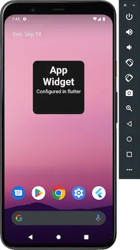

# App Widget

[](https://github.com/noxasch/flutter_app_widget/actions/workflows/interface.yaml)
[](https://github.com/noxasch/flutter_app_widget/actions/workflows/android.yaml)
[](https://github.com/noxasch/flutter_app_widget/actions/workflows/main.yaml)

This plugin attempt to exposed as much useful API and callback to flutter to reduce
going back and forth to native and make building app widget / home screen widget easier
and can be manage fully from flutter side keeping app codebase logic in flutter.


|                                         |                                 |
| ---                                     | ---                             |
|  |   |

## Note
- Please see the changelogs for breaking changes
- Every minor version update might introduce a breaking changes as this plugin is still considered alpha

## Caveats

Configuring or opening a screen from the widget is slower (unless the app is still active in the background)
compare to native because we need to wait for flutter engine to start. Hence as you can see from the gif there
is some delay and without the launch screen we can notice this delay. Howver on Android, most likely your
app start time will going to improve over time except during the first time user open it after an update.
So this shouldn't be an issue. Although we can notice significant delay in old phone and in debug mode.

## Plaform Support

As of current state I have no capacity to support for iOS, but help is welcome.

| Android | iOS |
| :-----: | :-: |
|   ✔️    |   |

## Using this package

### Widget Storage and Caching
This plugin doesn't dictate on how to handle widget update/storage/caching.
It simply provide api to manage the widget from flutter.

### Table Of Content

Platform Setup
- [Android]()
    - [Android Setup](#android-setup)
    - [Plugin Api Usage and callbaks](#in-app-usage-and-dartflutter-api)
    - [Update using flutter workmanager](#handling-widget-update-using-in-flutter-workmanger)
    - [Update widget using widget provider in kotlin](#handling-widget-update-using-appwidgetprovider-in-kotlin)

### Platform setup

#### Android

> Note: It is advisable to do this setup using Android Studio since it help you design the widget layout and proper linting and import in kotlin file.

There are multiple ways you can update the widget on Android:
1. Using AppWidgetProvider / BroadcastReceiver
2. Using workmanager
3. Using alarm manager
4. Using android service

Which by you can handle this in flutter using:
1. [Flutter Workmanager](https://pub.dev/packages/workmanager)
2. [android_alarm_manager_plus](https://pub.dev/packages/android_alarm_manager_plus)
3. Natively using `AppWidgetProvider`

##### Android Flavor support

simply include main android package name use by the MainActivity without flavor prefix.
Otherwise just omit the packageName as it will use your default package name.

```dart
final appWidgetPlugin = AppWidgetPlugin(
  androidPackageName: 'tech.noxasch.app_widget_example',
);
```

##### Android Setup


1. Add widget layout in `android/app/src/main/res/layout/example_layout.xml`

```xml
<?xml version="1.0" encoding="utf-8"?>

<LinearLayout xmlns:android="http://schemas.android.com/apk/res/android"
    xmlns:tools="http://schemas.android.com/tools"
    android:layout_width="match_parent"
    android:layout_height="match_parent"
    android:layout_margin="8dp"
    android:orientation="vertical"
    android:gravity="center"
    android:padding="8dp"
    android:background="@drawable/widget_background"
    android:id="@+id/widget_container">

    <TextView
        android:id="@+id/widget_title"
        android:layout_width="match_parent"
        android:layout_height="wrap_content"
        android:textSize="36sp"
        android:textStyle="bold"
        tools:text="Title" />

    <TextView
        android:id="@+id/widget_message"
        android:layout_width="match_parent"
        android:layout_height="wrap_content"
        android:textSize="18sp"
        tools:text="Message" />
</LinearLayout>
```

2. Add `appwidget-provider` info `android/app/src/main/res/xml/my-widget-provider-info`

```xml
<?xml version="1.0" encoding="utf-8"?>
<appwidget-provider xmlns:android="http://schemas.android.com/apk/res/android"
    android:minWidth="80dp"
    android:minHeight="80dp"
    android:targetCellWidth="3"
    android:targetCellHeight="2"
    android:updatePeriodMillis="86400000"
    android:initialLayout="@layout/example_layout"
    android:configure="tech.noxasch.app_widget_example.MainActivity"
    android:widgetCategory="home_screen"
    android:widgetFeatures="reconfigurable">
</appwidget-provider>
 <!--
   android:configure - full app name .MainActivity
   android:initialLayout - should point to an actual layout for the widget
   refer to https://developer.android.com/develop/ui/views/appwidgets/overview
 -->
```

3. Update Android manifest `android/app/src/main/AndroidManifest`

  - add intent-filter to the `MainActivity` activity block if you want to support widget initial configuration

  ```xml
    <activity
      android:name=".MainActivity"
      ...>
        ...
        <!-- add this -->
        <intent-filter>
            <action android:name="android.appwidget.action.APPWIDGET_CONFIGURE"/>
        </intent-filter>
    </activity>
  ```

  - add receiver for widget provider to listen to widget event (after Activity block)

  ```xml
  </activity>
  <!-- after or outside activity -->
  <receiver android:exported="true" android:name="MyWidgetProvider">
      <intent-filter>
          <action android:name="android.appwidget.action.APPWIDGET_UPDATE"/>
          <action android:name="android.appwidget.action.APPWIDGET_DELETED"/>
      </intent-filter>
      <meta-data android:name="android.appwidget.provider"
          android:resource="@xml/app_widget_example_info" />
  </receiver>
  ```
4. Create the widget provider in `android/app/src/main/kotlin/your/domain/path/MyWidgetExampleProvider.kt`
Inherit from Android `AppWidgetProvider` and implement the required method if needed. Since the plugin already provide interface to update widget, we can leave it empty and handle it on dart/flutter side.

    Probably you want to implement `onDeleted` or `onDisabled` method to handle cleanup like removing the widget Id from sharedPrefences allow user to add multiple widget.

```kotlin
package com.example.my_app

class MyWidgetExampleProvider : AppWidgetProvider()
```

5. Update MainActivity to handle `onConfigure` intent

```kotlin
package com.example.my_app

import android.appwidget.AppWidgetManager
import io.flutter.embedding.android.FlutterActivity
import io.flutter.embedding.engine.FlutterEngine
import tech.noxasch.app_widget.AppWidgetPlugin

class MainActivity: FlutterActivity() {
  override fun onFlutterUiDisplayed() {
    super.onFlutterUiDisplayed()

    AppWidgetPlugin.Companion.handleWidgetAction(context, intent)
  }
}
```

6. By now you should be able to add a widget. Next step is to configure it from flutter side
and make sure the widget configured.


### In App Usage and Dart/Flutter Api

This section shows how to use the exposed api by the plugin in your app.

```dart
// instantiate appWidgetPlugin
// recommended to include your app package name for android
// this help to resolves flavored version of the app
final appWidgetPlugin = AppWidgetPlugin(
  androidPackageName: 'tech.noxasch.app_widget_example',
);
await appWidgetPlugin.configureWidget(...)
```

#### handling onConfigureWidget

```dart
// this method can be declare as a top level function or inside a widget as a member function
@pragma('vm:entry-point')
void onConfigureWidget(int widgetId, int layoutId, String layoutName) async {
  // handle widget configuration
  // eg:
  // redirect or use launchUrl and deeplink redirect to configuration page
  // store widgetId, layoutId and layoutName in sharedPref
  // use layoutName to build proper payload

  // layoutName: tech.noxasch.app_widget_example:layout/example_layout
}

// onConfigureWidget callback are optional
// without this it will use default value that you set
final appWidgetPlugin = AppWidgetPlugin(
  onConfigureWidget: onConfigureWidget
);

// this changes will reflect on the widget
// only use this method in widget configuration screen as
// it method will close the app which require to signal the widget config completion
await appWidgetPlugin.configureWidget(
   // change to androidPackageName - we needed as param since there is no standard on how long the domain name can be
  widgetId: _widgetId!,
  layoutId: _layoutId!,
  textViews: {
    'widget_title': 'MY WIDGET',
    'widget_message': 'This is my widget message'
  },
  payload: '{"itemId": 1, "stringUid": "uid"}',
  url: 'deeplink or url'
);
```
#### Cancelling
Call this method to properly cancel widget first time configuration

```dart
await appWidgetPlugin.cancelConfigure()
```

#### handling onClickWidget

```dart
// this method can be declare as a top level function or inside a widget
void onClickWidget(String? payload) {
  // handle click widget event
  // eg:
  // redirect to item page
  // use launchUrl and deeplink redirect
}

// onClickWidget callback are optional
final appWidgetPlugin = AppWidgetPlugin(
  onConfigureWidget: onConfigureWidget,
  onClickWidget: onClickWidget
);
```

#### updateWidget
Make sure you store the `widgetId` and `layoutId` during widget configuration.

Tips: Store `layoutName` to easily manage payload textViews for multiple layout

Most of the time you'll want to update widget via workmanager. See [below](#handling-widget-update-using-in-flutter-workmanger)
how to use the plugin in workmanager.

```dart
await appWidgetPlugin.updateWidget(
  widgetId: _widgetId!,
  layoutId: _layoutId!,
  textViews: {
    'widget_title': 'MY WIDGET',
    'widget_message': 'This is my widget message'
  },
  payload: '{"itemId": 1, "stringUid": "uid"}',
  url: 'deeplink or url'
);
```

#### reloadWidgets
- use this method if you handle update in your widget provider want want to trigger force
reload widgets from flutter
- this will trigger `onUpdate` intent in your widget provider

```dart
await appWidgetPlugin.reloadWidgets(
  androidProviderName: 'AppWidgetExampleProvider',
});
```

#### widgetExist
- check if widget is exist
- on android this utilize `appWidgetManager.getAppWidgetInfo`

```dart
final widgetId = 12;

if (await appWidgetPlugin.widgetExist(widgetId)) {
  // do something if widget exist
}
```

### getWidgetIds
- return widgetIds which utilized `appWidgetManager.getAppWidgetIds` on android
- might be unreliable. if you have a problem see this [issue](https://stackoverflow.com/questions/12462696/appwidgetmanager-getappwidgetids-returning-old-widget-ids)

```dart
await appWidgetPlugin.getWidgetIds(
  androidProviderName: 'AppWidgetExampleProvider'
);
```

## Handling Widget update using in Flutter Workmanger
- there is a bug in android that cause your widget to flash and become blank.
- To make sure this bug doesn't affect your widget udpate, you'll need to register
another task that longer maybe than your update widget task, and then cancel it
inside the callback.
- to avoid this use workmanager periodicTask instead

```dart
// Using workmanager chained OneOffTask
@pragma('vm:entry-point')
void onConfigureWidget(int widgetId, int layoutId) async {
  final sharedPrefs = await SharedPreferences.getInstance();
   await sharedPrefs.setInt('widget_id', widgetId);
   await sharedPrefs.setInt('layout_id', layoutId);
  // register task druing configure event in onConfigure callback
  await Workmanager().registerOneOffTask(
    'UpdateMyWidget',
    'updateWidget',
    tag: 'WIDGET_PLUGIN',
    existingWorkPolicy: ExistingWorkPolicy.keep,
    initialDelay: const Duration(minutes: 5),
  );
  // register a dummy task
  // dummy task is required to fix flickering bug
  // https://stackoverflow.com/questions/71603702/in-android-glance-widgets-are-flickering-during-every-update-even-if-there-i
  await Workmanager().registerOneOffTask(
    'DUMMY_TASK',
    'dummyTask',
    tag: 'DUMMY_TASKS',
    existingWorkPolicy: ExistingWorkPolicy.keep,
    initialDelay: const Duration(days: 365),
  );
}

// Using workmanager PeriodicTask
@pragma('vm:entry-point')
void onConfigureWidget(int widgetId) async {
  final sharedPrefs = await SharedPreferences.getInstance();
  await sharedPrefs.setInt('widget_id', widgetId);
  await sharedPrefs.setInt('layout_id', layoutId);
  // register task druing configure event in onConfigure callback
  await Workmanager().registerPeriodicTask(
    '$kUpdateWidgetTask-$widgetId',
    kUpdateWidgetTask,
    tag: kUpdateWidgetTag,
    frequency: kWidgetUpdateIntervalDuration,
    existingWorkPolicy: ExistingWorkPolicy.replace,
    backoffPolicy: BackoffPolicy.exponential,
    backoffPolicyDelay: const Duration(
      seconds: 10,
    ),
    initialDelay: const Duration(minutes: kWidgetUpdateIntervalInMinutes),
    inputData: {
      'widgetId': widgetId,
      'layoutId': layoutId,
      'payload': payload,
    },
  );
}

// in callbackDipatcher or some other file
final worksMapper = {'updateWidget': updateWidgetWorker};

@pragma('vm:entry-point')
void callbackDipatcher() async {
  Workmanager().executeTask((taskName, inputData) async {
     try {
      if (taskName ==  'updateWidget') {
        await updateWidgetWorker()
      }
    } catch (err) {
      return false;
    }
    return true;
  });
}


@pragma('vm:entry-point')
Future<void> updateWidgetWorker() async {
  final sharedPrefs = await SharedPreferences.getInstance();
  final appWidgetPlugin = AppWidgetPlugin(
    androidPackageName: 'tech.noxasch.app_widget_example',
    onConfigureWidget: onConfigureWidget,
  );

  // Ssqlite database using drift to support multiple connection
  final connection = await _openConnection();
  final db = AppDatabase.connect(connection);
  final repo = db.todosRepository;

  final widgetId = sharedPrefs.getInt('widget_id');
  final layoutId = sharedPrefs.getInt('layout_id');

  if (widgetId != null) {
    await appWidgetPlugin.updateWidget(
      widgetId: widgetId!,
      layoutId: layoutId,
      textViews: {
        'widget_title': 'MY WIDGET',
        'widget_message': 'This is my widget message'
    });
    await Workmanager().cancelByUniqueName('DUMMY_TASK');
  }
}
```

## Handling Widget update using AppWidgetProvider in Kotlin

```kotlin
class AppWidgetExampleProvider : AppWidgetProvider() {
    override fun onUpdate(
        context: Context?,
        appWidgetManager: AppWidgetManager?,
        appWidgetIds: IntArray?
    ) {
        super.onUpdate(context, appWidgetManager, appWidgetIds)

        // check if widgetId store sharedPreferences
        // fetch data from sharedPreferences
        // then update
        for (widgetId in appWidgetIds!!) {
            val remoteViews = RemoteViews(context!!.packageName, R.layout.example_layout).apply() {
                setTextViewText(R.id.widget_title, "Widget Title")
                setTextViewText(R.id.widget_message, "This is my message")
            }

            appWidgetManager!!.partiallyUpdateAppWidget(widgetId, remoteViews)
        }
    }
}
```


<!--
Will include a sample using `flutter workmanager` and `AppWidgetProvider`
7. Implement onEnabled (update widget on reboot) - this has to be done from android ?

6. Implement android WidgetProvider - Already done

#### Dark Mode
- move this to blog post add link and also link to android official docs
-->

#### Testing
You can test this plugin by mocking the required methodChannel directly and set
debugDefaultTargetPlatformOverride to your preferred platform if needed.

```dart
void main() {
  TestWidgetsFlutterBinding.ensureInitialized();

  const MethodChannel channel = MethodChannel(AppWidgetPlatform.channel);
  final List<MethodCall> log = <MethodCall>[];
  

  TestDefaultBinaryMessengerBinding.instance.defaultBinaryMessenger
      .setMockMethodCallHandler(channel, (methodCall) async {
    log.add(methodCall);
    switch (methodCall.method) {
      case 'getPlatformVersion':
        return '42';
      case 'configureWidget':
        return true;
      case 'cancelConfigureWidget':
        return true;
      case 'getWidgetIds':
        return [];
      case 'reloadWidgets':
        return true;
      case 'widgetExist':
        return true;
      default:
        return null;
    }
  });

  setUp(() {
      debugDefaultTargetPlatformOverride = TargetPlatform.android;
  });

  tearDown(() {
    log.clear();
  });

  test('', () async {
    final appwidgetPlugin = AppWidgetPlugin();

    expect(await appwidgetPlugin.configureWidget(
      ...
    ), isTrue);

    // testing if your method that call configureWidget sending the expected arguments - interface level only
    expect(log, <Matcher>[
        isMethodCall(
          'configureWidget',
          arguments: <String, Object>{
            'androidPackageName': 'appname', // androidPackageName is included behind the scene
            'widgetId': 1,
            'layoutId': 1,
            'textViews': {},
            'payload': '{"itemId": 1, "stringUid": "uid"}'
          },
        )
      ]);
  });
```

#### References
- [Android developers - App Widgets](https://developer.android.com/develop/ui/views/appwidgets)
- [Android developers - Updating widget and creating widget preview](https://developer.android.com/develop/ui/views/appwidgets/advanced)

## Checklist
- [x] Unit Test
- [x] update documentation to cover api usage
- [x] Test example
- [x] Update example app
- [x] Github Action Workflow (CI)
- [x] Update Screenshot
- [ ] iOS support
